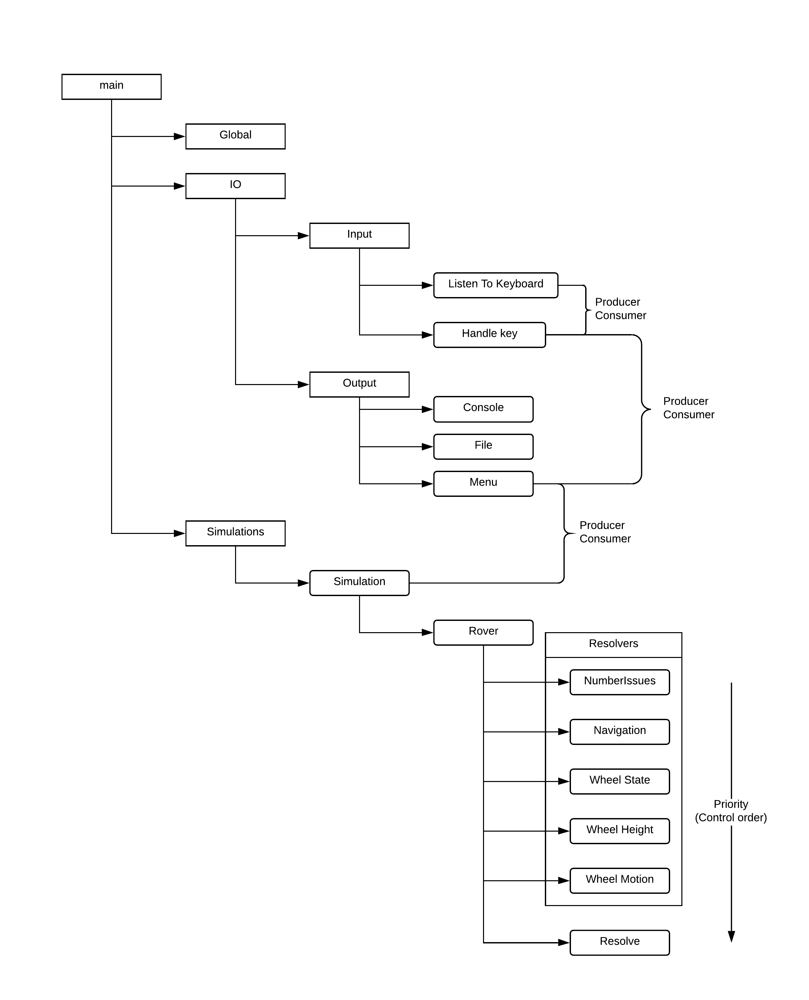

# Report

## Design decisions

### Clean exit

One of the more difficult aspects of this project was creating a way for the program to cleanly exit when the user presses q.
All threads check a global boolean to see if the user has pressed q. This boolean is atomic which, in C++ at least, is guaranteed to be thread-safe and does not need a condition variable to protect it.  

Originally, I had each thread's while condition to check the Global::running variable.
However, the first statement of each thread's loop was to wait for control.  
The thread would wait for control and, even if the user wanted to quit, would be stuck waiting for control.  
Now, each waitForControl checks for Global::running as well as if it has control.
However, this meant that it gave all threads control.  
As such, after each waitForControl is now another Global::running check which breaks the thread's while loop, and lets the thread exit.

### Join separation

Continuing the above, all threads are stored as a variable and default initialised.
This allows the main thread to spawn all required threads first, wait for quit, and then join the threads.
As such, the main thread is never needlessly blocked and the code is much cleaner.  

### Condition Variables

I used condition variables for all inter-thread communication, even outside the subsumption section.  
User input has a listener and a handler thread (and communicate like a Producer/Consumer pair.  
This allows for true thread safety which is critical for things like the console and file outputs as it needs to be in order.

### Output

All threads can call the console and file threads, however there is only one thread for each; a many-producer-one-consumer pattern.
This is better than spawning a thread specifically designed to output just one thing as that is still not thread safe and relies on the operating system to manage the order of calls correctly.  

## Subsumption

Subsumption is a way to resolve potential conflict of priorities. A rover could encounter many problems and will have a resolver dedicated to each problem. All the resolvers do is look at the data and provide a solution if it can. Each resolver is checking for something different. Multiple resolvers could mean several different solutions to a problem. So, the rover uses subsumption to analyse the issues of the wheels and decides what best to do. Without subsumption, the rover would most likely listen to the most recent suggestion and do that. This could cause the rover to move sporadically as the chosen solution could change every loop.  

In my model, once the simulator has generated some issues, the simulator passes control to the highest priority resolver. If it does not resolve the issue, it passes it to the next, which passes it to the next, and so forth. Each resolver is running in its own thread but does not constantly run. The resolver will wait for control to be passed to it and will only assess the situation once it has control.

In the above image you can see the general flowchart of the program.
Rounded-corner boxes represent threads.  
All threads include Global.  
The Simulation thread passes control to NumberIssues, and the Resolve thread passes control back to the Simulation.
It is possible no problems were encountered, in which case the resolver does not increment the Rover's encounters.
